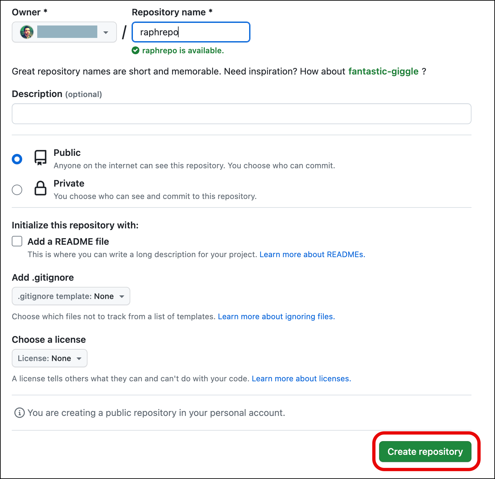
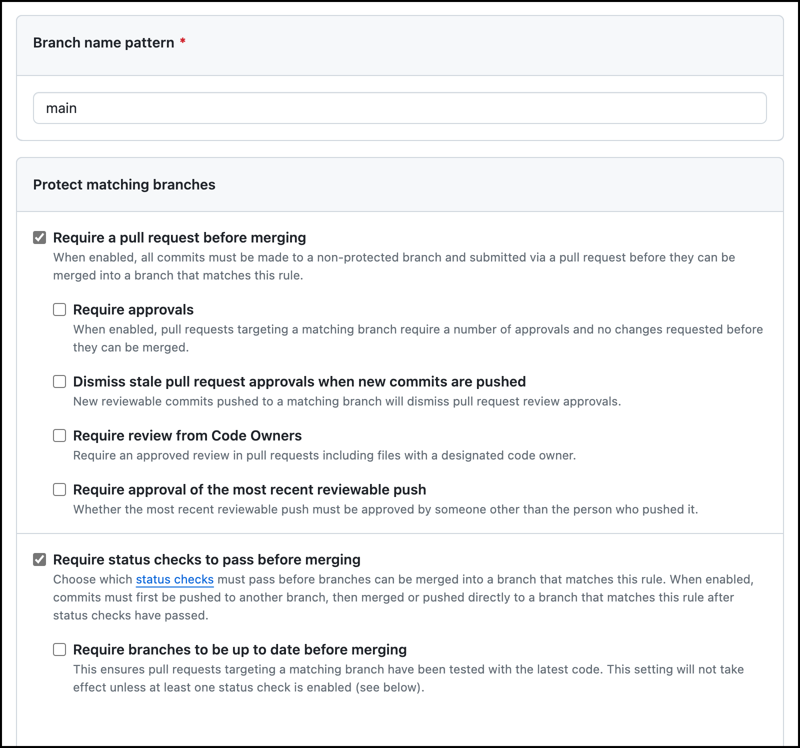
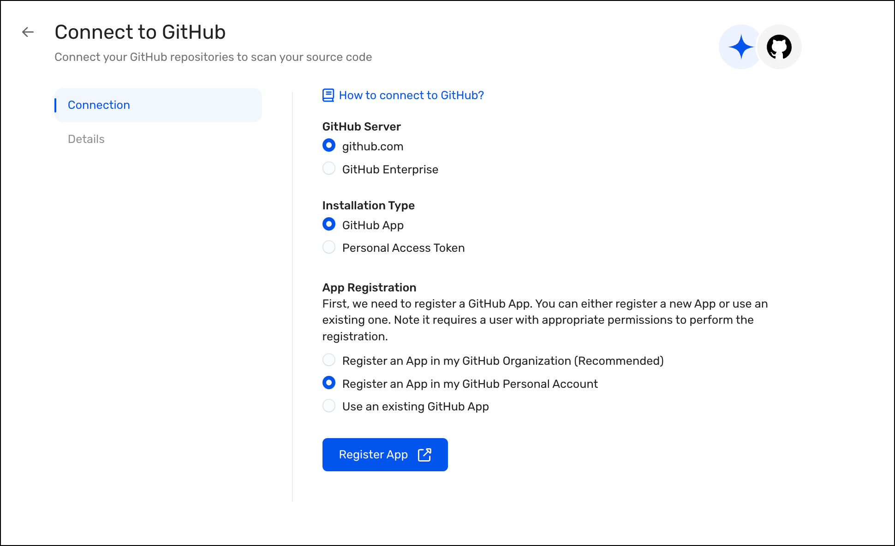
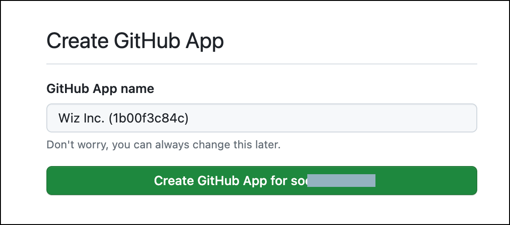

<div style="margin-right: 50px; margin-left: 30px;">

# Task: GitHub Connector Deployment
---

In this task, you will deploy the Wiz GitHub connector, test the repository scanning capabilities, and see results of scans in the Wiz portal.

## Setup your GitHub repostory

1. Log into your GitHub account. If you don't have one, sign up at [https://github.com/signup](https://github.com/signup)

1. On the Home page, click on **New** to create a new repository.

1. Give your repository a name. Leave the repository as Public, and click on **Create repository**.

   <p align="left">
      
      </p> 

1. On your repo's main page, click on the **README** link to create a readme file for your repo. 

1. Click on **Commit changes...**

1. This will initialize your repo.

1. On your repo's main page, click on **Settings**.

1. Under General, select **Branches**. Click on **Add branch protection rule**.

1. Under *Branch name pattern* type `main`.

1. Under *Protect matching branches*, select:

    - **Require a pull request before merging**
        - unselect **Require approvals**
    - **Require status checks to pass before merging**

   <p align="left">
      
      </p> 

1. Scroll down and click on **Create**.

1. Go to the repo's main page by clicking on **< > Code**

To make things easier, we will use GitHub's web editor to manage the repo. You may manage your repo as you wish (GitHub Desktop, CLI, VSCode, etc).

## Deploy the GitHub Connector

1. Go to the tab where you have the Wiz portal open.

1. Navigate to **Settings > Deployments**.

1. Click on **+ Add Deployment**.

1. Under the Version Control section, click on **GitHub**.

   <p align="left">
      
      </p> 

1. On the Connect to GitHub page, Select:

    - GitHub Server: github.com
    - Installation Type: GitHub App
    - App Registration: Register an App in my GitHub Personal Account

   <p align="left">
      
      </p> 

1. Click on **Register App**.

1. In the Create GitHub App page, click on **Create GitHub App for <your username>

   <p align="left">
      
      </p> 

1. Back to the Connect to GitHub page, you should see the `App Registered` status. Click on **Install App**.

   <p align="left">
      
      </p> 

1. In the install app page, you can enable the app to scan all repos or select just specific ones.

   <p align="left">
      
      </p> 

1. Click on **Install**.

1. The app is now installed, and you are redirected to the deployment page. Click on **Continue**.

   <p align="left">
      
      </p> 

1. Give a name to your connector:

   <div style="margin-right: 150px;">
   
   ```  
   <inject key="odlUser" enableCopy="false"></inject>-gh-connector
   ``` 
   
   </div>

1. Leave all of the default settings unchanged, and click on **Finish**.

1. Your connector's status will be *Initializing*. Wait until it changes to *Active*.

   <p align="left">
      
      </p> 

Your connector is now deployed, proceed to the **Next** page.

</div>
